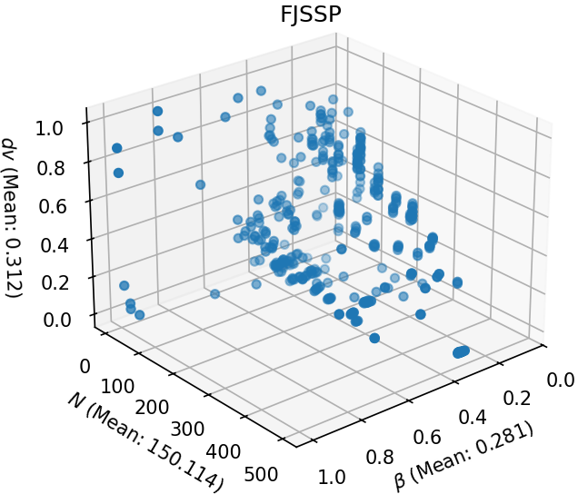
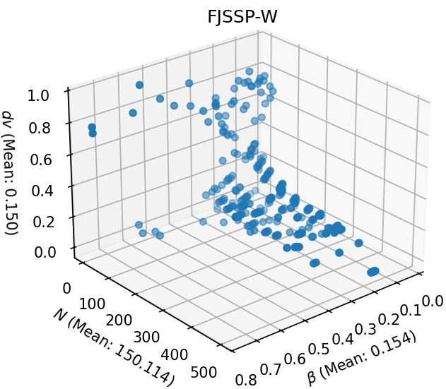
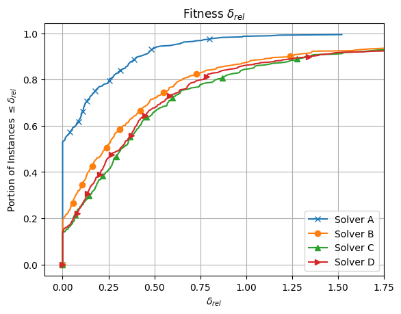
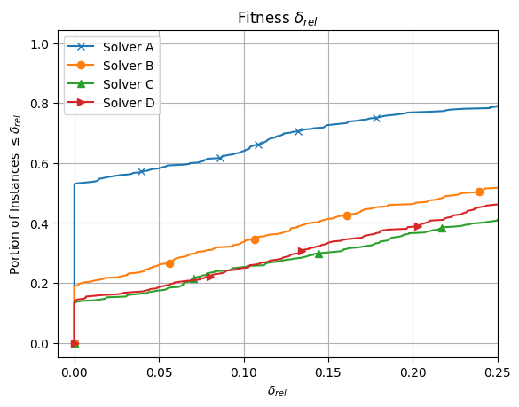
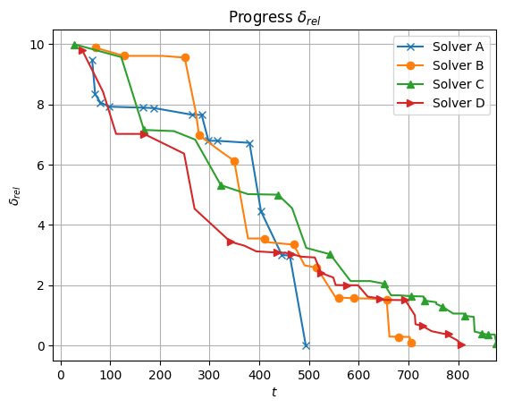
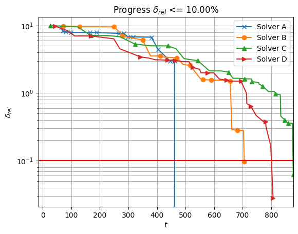

# FJSSP and FJSSP-W Benchmarking Environment
This provided environment can be used to test and compare different algorithms for the flexible job shop scheduling problem (FJSSP) and the FJSSP with worker flexibility (FJSSP-W). The provided benchmark instance collection can be found in the "instances" subdirectory, including some example instances for the FJSSP-W. Also provided in the directory "InstanceData" are known best results and lower bounds for the different problems and their instances.
"util" contains the provided evaluation and comparison functionality of the benchmarking environment, including the algorithm used to create FJSSP-W problem instances from the well known FJSSP instances.

## FJSSP-W Benchmarking Instances

Note that while a translation algorithm between FJSSP and FJSSP-W instances is provided, the FJSSP-W instances are generated randomly (based on the respective FJSSP instance). The provided best known results for the FJSSP-W are specific to the FJSSP-W instances which are provided and can not not be used for comparison with newly generated instances.

## Structure
The repository is divided into the [util](https://github.com/jrc-rodec/FJSSP-W-Benchmarking/tree/main/util) and [instances](https://github.com/jrc-rodec/FJSSP-W-Benchmarking/tree/main/instances) subsections, as well as the example files in the root directory.

### Util
The util section contains the provided APIs for comparison and evaluation.
The provided APIs include an algorithm to translate FJSSP to FJSSP-W instances, methods for visualization and comparison of results, evaluation metrics, and utilities to load and parse both FJSSP and FJSSP-W benchmark instances into python objects.
Additionally, to establish a baseline for comparison, a greedy solver is included which can solve the given benchmark problems.

### Instances
The instances section containts the problem instances, including example FJSSP-W instances created by the translation algorithm provided in the util section.
Additionally, the [InstanceData](https://github.com/jrc-rodec/FJSSP-W-Benchmarking/tree/main/instances/InstanceData) subfolder contains data about the benchmark instances and their characteristics, as well as a collection of known best results (lower bound and upper bound).

### Examples
The example files demonstrate different aspects of the benchmarking environment to help with the understanding of the provided APIs.

## Benchmark Selection
The benchmarking environment offers a filter option that allows benchmark instances to be selected according to the desired benchmark properties. 

FJSSP Overview           |  FJSSP-W Overview
:-------------------------:|:-------------------------:
 | 

The figures displayed above show the distribution of benchmark instances in relation to some of the filterable problem properties, for the provided FJSSP and FJSSP-W instances. There are several clusters of instances that are very similar in these characteristics. To efficiently test how well an algorithm applies to the more general problem, it may be desirable to first select only representatives of the clusters to save computation time and generate the most representative subset of instances possible to avoid potential biases in the results analysis.
The filterable features include the number of operations $\texttt{N}$, the number of machines, the number of workers, the flexibility $\beta$, the duration variety $dv$, the number of orders $n$, and various other features. Each characteristic can optionally be filtered with a predefined lower and upper limit for problem cases to be included in the experiments. This option is available for both the supplied FJSSP and FJSSP-W instances.

## Benchmark Preparation
Based on the provided filters (if any), the requested benchmarks can be loaded using built-in functions. The loading process returns all requested instances and provides several APIs to read their data. This includes the job sequence, which shows how many operations belong to each job, including their fixed position for the assignment vectors, the duration matrix $T$, the amount of operations $\texttt{N}$, machines $m$, worker $w$, and several other characteristics.

## Performance Evaluation
For comparisons to other solvers, the benchmark environment offers different visualizations of the results summarized over all used benchmark instances. The data of the evaluated solvers are included and best known results can be updated over time. Additionally, the benchmarking environment offers an API to calculate the MiniZinc score for comparison. A demonstration can be found in the provided examples below.

Result Overview           |  Zoomed-in Result Overview
:-------------------------:|:-------------------------:
 | 

The example result plots are shown in the plot above. For each compared scheduling algorithm, the illustration visualizes the proportion of problem instances that can be solved up to a given deviation from the best-known results on such instances. To this end, for each instance, the relative deviation, or gap, $\delta_{rel}$ of a solver's final best solution $C_{fb}=C(\mathbf{y}_{fb})$ from the best-known result $C_{best}$ on a particular instance is calculated

$\delta_{rel} = \frac{C_{fb} - C_{best}}{C_{best}}$

All instances that could be solved within the deviation $\delta_{rel}$ are then counted.
Finally, the ratio of instances solved within the gaps is then plotted against the respective $\delta_{rel}$ values.

For multiple solvers, the algorithm performance is considered to be better the closer the curve runs along the vertical axis. In such cases, larger proportions of the instances are solved with comparatively smaller deviations from the best-known solution.
While the figure on the left demonstrates a general overview of the performance differences among four exemplary solvers, the figure on the right zooms into the lower left part of the results in the first figure to focus on more subtle performance differences between solvers. One observes that Solver A exhibits the best performance as it realizes the best-known solution on approximately $55\%$ of the instances. On the contrary, Solver C shows the poorest performance.
Note that this representation is not suitable for drawing conclusions about the performance on individual instances but concentrates exclusively on the proportion of instances that could be solved to a given quality.

As can be seen in the figure, it can happen that some performance lines do not reach $\delta _rel = n1.0$. This happens if not all solvers could find feasible solutions for all the included instances. The visualizer is implemented in a way that it can handle missing data for the case in the example.

### Single instance evaluation
The plots shown below display the progress of a solver on a selected individual instance over time $t$ (measured in seconds). The example plots shows the relative deviation $\delta_{rel}$ of the best solution found by each solver from the best solution observed by all considered solvers in the left figure. Accordingly, the solver that first reaches $\delta_{rel} = 0$ exhibits superior performance in terms of speed (i.e., Solver A in the provided example).

Progress $\delta_{rel}$          |  Progress $\delta_{rel} \le 10\%$
:-------------------------:|:-------------------------:
 | 

The right figure displays the $\delta_{rel}$ dynamics towards a user-defined deviation (here 10\%) from the best-known solution (here provided by Solver A).
This target deviation is specified by the user and can be provided to the visualization tool as a parameter. 

Within the example data, all solvers reach the threshold distance to the best result in the given plots. However, if not all solvers reach the best result or get within the specified threshold, not all lines might intersect the horizontal solid red line. 
This can also happen if a limit on the horizontal axis is imposed on the plot. Note that not all solvers start at $t = 0$, since only feasible solutions are considered for the visualization of the dynamics.

## References for the included FJSSP problems
1. P. Brandimarte. Routing and Scheduling in a Flexible Job Shop by Tabu Search. Annals of Operations Research, 41(3):157–183, 1993.
2. J. Hurink, B. Jurisch, and M. Thole. Tabu search for the job-shop scheduling problem with multi-purpose machines. Operations-Research-Spektrum, vol. 15, no. 4, pp. 205–215, 1994.
3. S. Dauzère-Pérès and J. Paulli. Solving the General Multiprocessor Job-Shop Scheduling Problem. Technical report, Rotterdam School of Management, Erasmus Universiteit Rotterdam, 1994.
4. J. B. Chambers and J. W. Barnes. Flexible Job Shop Scheduling by Tabu Search. The University of Texas, Austin, TX, Technical Report Series ORP96-09, Graduate Program in Operations Research and Industrial Engineering, 1996.
5. I. Kacem, S. Hammadi, and P. Borne. Pareto-Optimality Approach for Flexible, Job-Shop Scheduling Problems: Hybridization of Evolutionary Algorithms and Fuzzy Logic. Mathematics and Computers in Simulation, 60(3-5):245–276, 2002.
6. P. Fattahi, M. S. Mehrabad, and F. Jolai. Mathematical Modeling and Heuristic Approaches to Flexible Job Shop Scheduling Problems. Journal of Intelligent Manufacturing, 18(3):331–342, 2007.
7. Behnke, D., & Geiger, M. J. (2012). Test instances for the flexible job shop scheduling problem with work centers. Arbeitspapier/Research Paper/Helmut-Schmidt-Universität, Lehrstuhl für Betriebswirtschaftslehre, insbes. Logistik-Management.